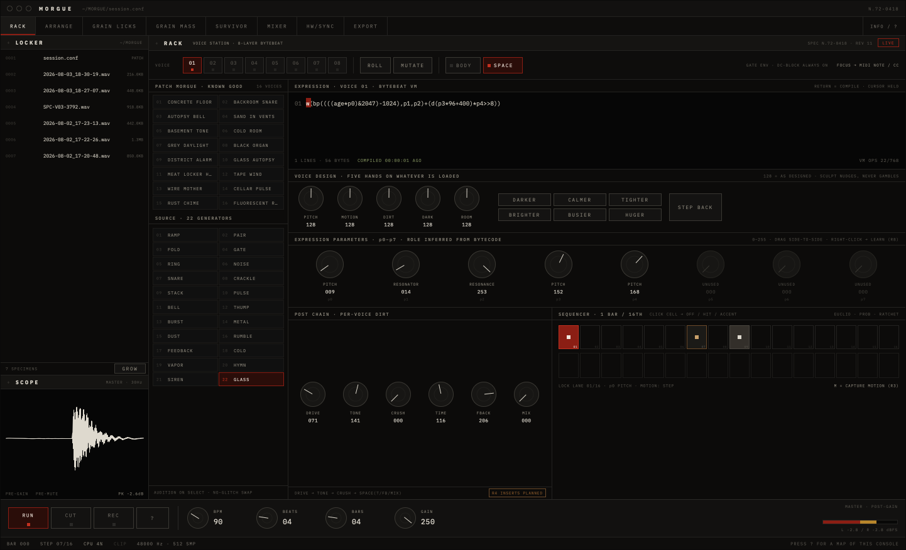
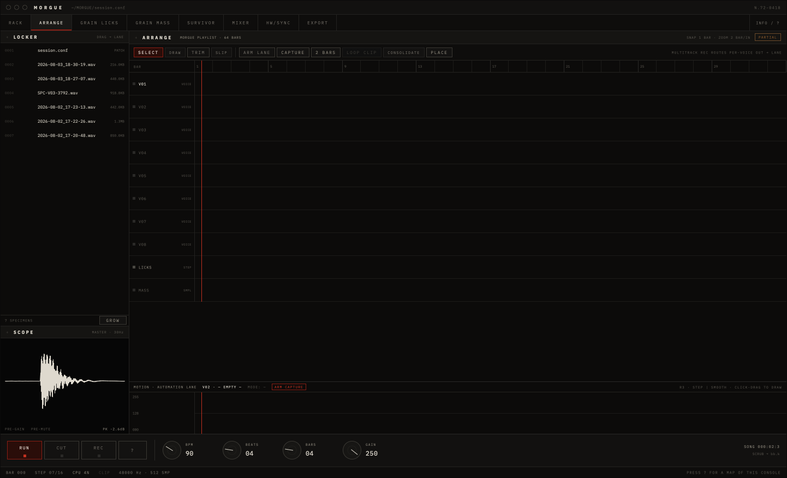
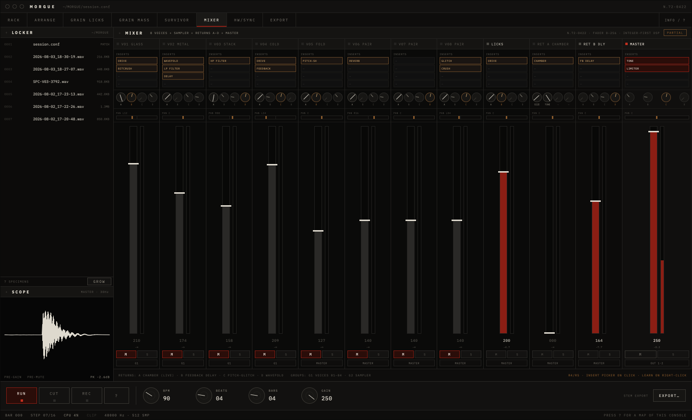

# MORGUE

An instrument for dark noise, ambience and terror: an eight-voice bytebeat
synthesizer with a drum machine, granular wells, a master phrase looper, a
cavernous reverb bus, and a song timeline — behind a cold, clinical,
autopsy-archive interface. Everything you hear is a live-compiled integer
expression; the panel just puts hands on it.



A JUCE desktop app over **one realtime C engine**, building and running on
**Windows, macOS and Linux**. A **3,241-check headless regression suite**
exercises the whole thing — DSP, sequencer, loop bank, return bus, timeline,
sessions — on any machine with a C compiler, no sound card and no submodule
required, and CI runs it on four toolchains (MSVC, Apple Clang, gcc, clang).

The ncurses terminal instrument is retired: `main.c`, `ui.c`, `audio.c`, its
raw-PCM sink and the page that documented them are all out of the tree. The
regression suite was the valuable part and now lives in `tests/` as its own
target, `morgue-tests`.

## The console

| Workspace | What it does |
|---|---|
| **RACK** | The voice station. 16 curated patches, 22 expression generators, a live bytebeat editor, knobs with roles inferred from the compiled bytecode, per-voice post chain, 16-step sequencer with pitch/ratchet/probability/parameter-lock lanes, armed by the SEQ switch. |
| **ARRANGE** | The song timeline. Record any voice or the drum bus into bar-aligned clips, drag/trim/loop them across 64 bars, place WAVs from the locker, seek by clicking the ruler. Its own PLAY/STOP, and a REC source that leaves the arrangement out of the take so you can overdub against it. |
| **GRAIN LICKS** | The drum machine: 8 sample slots × 16 steps with per-step pitch and velocity, choke groups, mute/solo. On first run the engine synthesizes a kick, snare and hat into the first three slots and writes a starting pattern across them, so the panel makes sound before a file is loaded. |
| **GRAIN MASS** | Four sample wells: load anything, pitch it ±24 semitones, reverse it, loop it. PLAY ALL starts every well together on the next bar. |
| **SURVIVOR** | The loop bank: six bar-synced loopers. Slot 0 is the master phrase looper; the other five record **LIVE** — voices, sampler and returns, but never another looper — so layers stack without recording each other. Commit any finished loop to an ARRANGE lane. |
| **MIXER** | Faders, mutes and meters, plus the **return bus**: eight ad-hoc slots (CHAMBER, DELAY, DRIVE, CHOIR), a 12×8 send matrix, and a link grid so returns feed each other. Every link is one sample old, which is what makes any feedback patch bounded. |
| **HW/SYNC** | MIDI in: notes trigger and re-pitch the focused voice, CC1 rides p0. |
| **EXHUME** | archive.org acquisition: search, audition, and download into the locker, transcoded and carrying its licence and provenance. |
| **PLATE** | The visual wing: a watched INTAKE folder for scans and captures, and generation loss as a seeded, reproducible operator chain. |
| **EXPORT** | Stem rendering — **planned, and the sheet says so.** The engine has no stem renderer yet. |

A layer's sequencer fires no triggers at all while its **SEQ** switch is off,
which for a struck source means no sound whatsoever: THUMP is
`bp(tr*vel*4096,p0,p1)`, the trigger is its only input, and an unarmed THUMP
layer renders exact silence rather than something merely quiet. SEQ sits at the
right end of the sequencer head, and lays down E(4,16) when the grid is empty
so that arming a layer always leaves something audible behind.

Press `?` anywhere for the field manual.



## Directed sound design

Writing the maths and rolling dice are usually the only two ways to get a
voice out of a machine like this. Four controls sit between them, so you can
direct a sound without composing an expression and without gambling:

- **PATCH MORGUE** — sixteen named, known-good voices (CONCRETE FLOOR,
  COLD ROOM, DISTRICT ALARM, GLASS AUTOPSY…). Click one; it sounds.
- **VOICE DESIGN** — five macros that always mean the same thing — PITCH ·
  MOTION · DIRT · DARK · ROOM — driving whichever knobs of the current
  voice carry that meaning, worked out from the compiled bytecode.
- **SCULPT** — mutation with a direction: DARKER / BRIGHTER, CALMER /
  BUSIER, TIGHTER / HUGER, with STEP BACK to undo. Nudges, never gambles.
- **GROW** — renders the focused voice as a self-looping specimen WAV
  (whole bars at your tempo, slow parameter drift, a few cents of tape
  warble) straight into the locker, ready for a well or a timeline lane.

And when you do want the math: the expression editor is right there, compiles
on RETURN with no glitch, and a failed compile keeps the old program running.



## Build

There are presets for every platform, so the build is the same three lines
everywhere:

```sh
git clone --recursive https://github.com/dodontommy/bytebeat.git
cd bytebeat
cmake --preset windows-msvc-relwithdebinfo     # or linux-gcc- / linux-clang- / macos-clang-
cmake --build --preset windows-msvc-relwithdebinfo
ctest  --preset windows-msvc-relwithdebinfo    # 3,241 checks
```

Requires CMake ≥ 3.22 (JUCE 8.0.15's floor) and a C11/C++17 toolchain. JUCE is
pinned as a submodule; the IBM Plex fonts ship embedded (OFL). If you cloned
without `--recursive`, run `git submodule update --init --recursive`.

- **Windows** — Visual Studio 2022 **17.5 or newer**, configured from a
  Developer prompt. C11 atomics need `/experimental:c11atomics`, which the
  build sets for you. Keep the build directory path SHORT: JUCE's own
  intermediate paths are long enough that a deep one blows past `MAX_PATH`
  and fails with an opaque `C1083`.
- **macOS** — Xcode command line tools. Nothing else.
- **Linux** — JUCE's system deps: `libasound2-dev libfreetype6-dev
  libfontconfig1-dev libx11-dev libxcomposite-dev libxcursor-dev libxext-dev
  libxinerama-dev libxrandr-dev libxrender-dev libglu1-mesa-dev
  mesa-common-dev`. No webkit — `JUCE_WEB_BROWSER=0`.

`morgue-tests` deliberately does not link JUCE, so the engine can be built and
proven with the submodule completely absent.

### Sourcing material without leaving the app

`tools/exhume.py` is the same archive.org client the EXHUME panel uses, as a
standalone CLI. Stdlib only; needs ffmpeg on PATH.

```sh
export MORGUE_CONTACT="you@example.com"   # archive.org is a donation-funded nonprofit
python tools/exhume.py search "civil defense" -c prelinger
python tools/exhume.py item AboutFal1963
python tools/exhume.py fetch AboutFal1963
```

Results are marked `+` clear / `?` verify per item / `X` personal use only, so
the licence question is answered while you browse rather than after a track is
built on it.

## The engine

`engine.c` is the instrument: the render loop, the voices, the step sampler,
the looper, the chamber, the timeline and the session file, with hard
realtime rules — the audio thread never allocates, never locks, never
blocks. Every knob is an atomic; programs, samples, clips and songs are
published to the audio thread by single atomic pointer swaps and reclaimed
only after two render epochs. Integer overflow is not a bug here -- the
overflow **is** the sound -- so the wrap is guaranteed by the code rather
than by a flag: `expr.c` does every arithmetic op in `uint32_t`, where
wrapping is defined, and negative left shifts go through the matching
unsigned type. `-fwrapv` is still passed on GCC, Clang and Apple Clang,
but MSVC has no equivalent and nothing here depends on one.

The signal path, per voice:

```text
expression -> gate -> drive -> tone -> crush -> SPACE -> level
           -> eight-voice sum + drums + clips -> CHAMBER return
           -> phrase looper -> master gain -> output
```

Sessions autosave as editable plain text at `~/MORGUE/session.conf`.
Recordings, captured clips and grown specimens land beside it, in the
locker.

## Documents

- [DESIGN_SPEC.md](DESIGN_SPEC.md) — product spec and the R1–R9 roadmap
- [design_handoff_morgue_gui/](design_handoff_morgue_gui/) — the pixel spec this GUI implements
- [HANDOFF.md](HANDOFF.md) — engineering state, for whoever builds next
- [NOTES.md](NOTES.md) — implementation tour · [EXAMPLES.txt](EXAMPLES.txt) — expression cookbook
